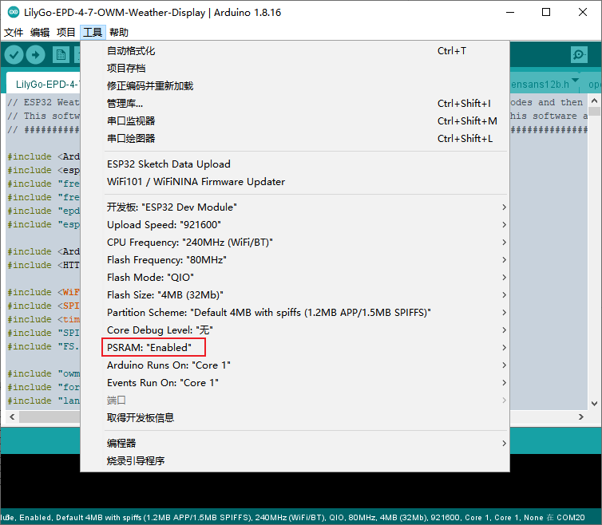
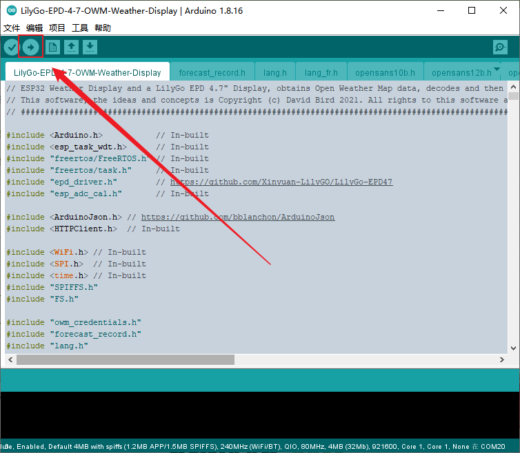
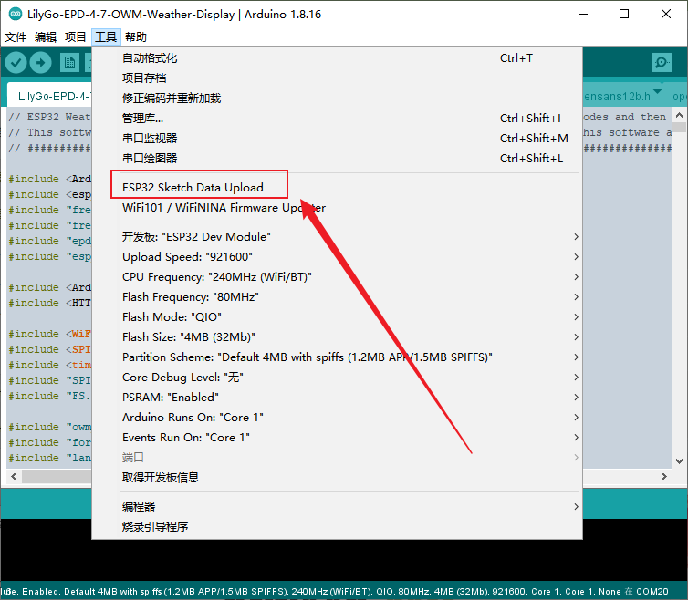
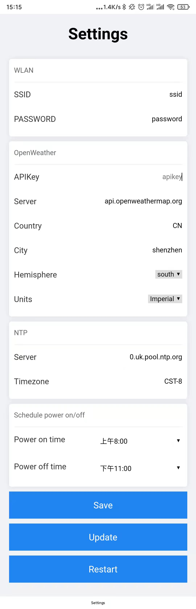

# LilyGo-EPD-4-7-OWM-Weather-Display

Using the LilyGo EPD 4.7" display to show OWM Weather Data

[Use video](https://youtu.be/ECVMiUjjzms)

## Flashing

1. configure

2. upload firmware

3. upload spiffs

    Please pre-install [ESP32 Filesystem Uploader](https://randomnerdtutorials.com/install-esp32-filesystem-uploader-arduino-ide/)

## Usage

1. Hold down the S3 button, lightly press the reset button, wait for 3-5S and release the S3 button.

2. Connect to the wifi of `T-EPD47-XXXX` using a mobile phone or PC.

3. Visit `http://192.168.4.1/settings` using a browser

4. Fill in the corresponding information and save.

5. Just press the reset button.

## TODO

* Schedule Power on/off

# FAQ

1. The board uses USB as the JTAG upload port. When printing serial port information on USB_CDC_ON_BOOT configuration needs to be turned on.
If the port cannot be found when uploading the program or the USB has been used for other functions, the port does not appear.
Please enter the upload mode manually.
   1. Connect the board via the USB cable
   2. Press and hold the BOOT(IO0) button , While still pressing the BOOT(IO0) button, press RST
   3. Release the RST
   4. Release the BOOT(IO0) button
   5. Upload sketch

